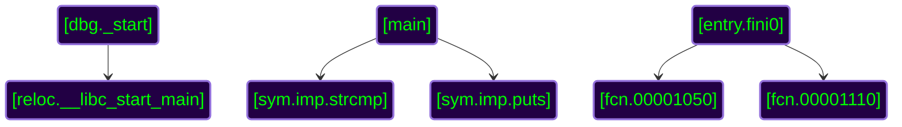

Let's take a look at [this](https://crackmes.one/crackme/68698837aadb6eeafb399017) easy crackme made by *toasterbirb*. You can also download it [here](/crackmes/68698837aadb6eeafb399017.zip); the password is `crackmes.one`. Let's unzip it and see what we have inside:


sh1r4s3@amanita[/tmp/argc]% ls -l
total 20
-rw-rw-r-- 1 sh1r4s3 sh1r4s3 18608 Jul  5 15:16 argc
sh1r4s3@amanita[/tmp/argc]% file argc
argc: ELF 64-bit LSB pie executable, x86-64, version 1 (SYSV), dynamically linked, interpreter /lib64/ld-linux-x86-64.so.2, for GNU/Linux 3.2.0, with debug_info, not stripped


OK, we have an ELF file with debug info, huh, the file isn't stripped. What external functions does this program use?



sh1r4s3@amanita[/tmp/argc]% nm -u argc | grep ' *U'
                 U __libc_start_main@GLIBC_2.34
                 U puts@GLIBC_2.2.5
                 U strcmp@GLIBC_2.2.5



The set is quite simple: `puts(3)` to print a string and `strcmp(3)` to compare two strings. The program is probably using `strcmp(3)` to compare input with something. Let's give it a shot and run the program:


sh1r4s3@amanita[/tmp/argc]% ./argc
please try again and make sure to give the correct amount of arguments („ᵕᴗᵕ„)


Alright... but how many arguments do we need to provide? It's time to blow the dust off our disassembler. I'll use the [radare2](https://www.radare.org/n/) tool but the reader can use a tool of their choice -- [objdump](https://www.gnu.org/software/binutils/), [gdb](https://www.sourceware.org/gdb/). First things first, I want to run the full analysis of the code (`aaa`) and get the call graph:

On the left side we have our typical libc entry point from `crt0.o` or `crt1.o`. In the middle is application's entry point -- `main()` function. On the right side, we have finalization code from `crtn.o`. Generally, we should focus on the middle column since for developers, `main()` is the entry point. From the call graph we can see that `main()` function uses only 2 external functions: `strcmp()` and `puts()`, nothing new. From this information we can conclude that the original C code, most likely contains all the logic in one function -- `main()`. Let's dive into the `main()` function:



[0x000010e0]> pdf @main
            ;-- section..text:
            ; ICOD XREF from dbg._start @ 0x10f8(r)
┌ 81: int main (uint32_t argc, char **s2);
│ `- args(rdi, rsi)
│           0x00001080      f30f1efa       endbr64                     ; [13] -r-x section size 377 named .text
│           0x00001084      53             push rbx
│           0x00001085      83ff03         cmp edi, 3                  ; argc
│       ┌─< 0x00001088      7539           jne 0x10c3
│       │   0x0000108a      488b4610       mov rax, qword [rsi + 0x10] ; argv
│       │   0x0000108e      488b7e08       mov rdi, qword [rsi + 8]    ; const char *s1
│       │   0x00001092      4889c6         mov rsi, rax                ; const char *s2
│       │   0x00001095      e8d6ffffff     call sym.imp.strcmp         ; int strcmp(const char *s1, const char *s2)
│       │   0x0000109a      89c3           mov ebx, eax
│       │   0x0000109c      85c0           test eax, eax
│      ┌──< 0x0000109e      7415           je 0x10b5
│      ││   0x000010a0      488d3dd50f..   lea rdi, str.wrong_passwords... ; 0x207c ; "wrong passwords..." ; const char *s
│      ││   0x000010a7      e8b4ffffff     call sym.imp.puts           ; int puts(const char *s)
│      ││   ; CODE XREF from main @ 0x10cf(x)
│     ┌───> 0x000010ac      bb01000000     mov ebx, 1
│     ╎││   ; CODE XREF from main @ 0x10c1(x)
│    ┌────> 0x000010b1      89d8           mov eax, ebx
│    ╎╎││   0x000010b3      5b             pop rbx
│    ╎╎││   0x000010b4      c3             ret
│    ╎╎││   ; CODE XREF from main @ 0x109e(x)
│    ╎╎└──> 0x000010b5      488d3da50f..   lea rdi, str.correct______  ; 0x2061 ; "correct! (\u02f6\u1d54 \u1d55 \u1d54\u02f6)" ; const char *s
│    ╎╎ │   0x000010bc      e89fffffff     call sym.imp.puts           ; int puts(const char *s)
│    └────< 0x000010c1      ebee           jmp 0x10b1
│     ╎ │   ; CODE XREF from main @ 0x1088(x)
│     ╎ └─> 0x000010c3      488d3d3e0f..   lea rdi, str.please_try_again_and_make_sure_to_give_the_correct_amount_of_arguments___ ; 0x2008 ; "please try again and make sure to give the correct amount of arguments (\u201e\u1d55\u1d17\u1d55\u201e)" ; const char *s
│     ╎     0x000010ca      e891ffffff     call sym.imp.puts           ; int puts(const char *s)
└     └───< 0x000010cf      ebdb           jmp 0x10ac



We know (from x86_64 Linux psABI) that `rdi` has the first argument and `rsi` has the second one. That is, `rdi` is `int argc` and `rsi` is `char **argv`. At `0x00001085` we see that the program compares `argc` against `3`. If the number of cmdline arguments is not 3, the program will jump to `0x000010c3` and output a message `"please try again and make sure to give the correct amount of arguments (\u201e\u1d55\u1d17\u1d55\u201e)"` which we already saw. OK, that's nice, now we got to know how many arguments we have to pass -- two (argv[0] is the command i.e. the program's name).

Let's take a look at the alternative branch, past the `jne` instruction. In this branch the program compares 2 arguments -- second and third. At `0x0000109e` the program checks for the result and if the strings are matching it jumps to `0x000010b5` and outputs a message that we've passed the test: `"correct! (\u02f6\u1d54 \u1d55 \u1d54\u02f6)"`, otherwise it outputs `"wrong passwords..."` message and returns with the error `1`. Looks to be pretty easy, let's try to use the obtained knowledge to solve this crackme:


sh1r4s3@amanita[/tmp/argc]% ./argc lol lol
please try again and make sure to give the correct amount of arguments („ᵕᴗᵕ„)


{: style="display: block; margin-left: auto; margin-right: auto;"}

Hmm... somehow it didn't work. The easiest way to understand what's wrong is to observe the program at runtime through a debugger. I'll use **gdb** for that purpose. The plan is to break at `main()` and follow the initial instructions. Let's do this:


(gdb) b main
Breakpoint 1 at 0x1080
(gdb) r lol lol
Starting program: /tmp/argc/argc lol lol

[snap]

Breakpoint 1, 0x0000555555555080 in main ()
(gdb) x/16i $pc
=> 0x555555555080 <main>:       endbr64
   0x555555555084 <main+4>:     push   %rbx
   0x555555555085 <main+5>:     cmp    $0x3,%edi
   0x555555555088 <main+8>:     jne    0x5555555550c3 <main+67>
   0x55555555508a <main+10>:    mov    0x10(%rsi),%rax
   0x55555555508e <main+14>:    mov    0x8(%rsi),%rdi
   0x555555555092 <main+18>:    mov    %rax,%rsi
   0x555555555095 <main+21>:    call   0x555555555070 <strcmp@plt>
   0x55555555509a <main+26>:    mov    %eax,%ebx
   0x55555555509c <main+28>:    test   %eax,%eax
   0x55555555509e <main+30>:    je     0x5555555550b5 <main+53>
   0x5555555550a0 <main+32>:    lea    0xfd5(%rip),%rdi        # 0x55555555607c
   0x5555555550a7 <main+39>:    call   0x555555555060 <puts@plt>
   0x5555555550ac <main+44>:    mov    $0x1,%ebx
   0x5555555550b1 <main+49>:    mov    %ebx,%eax
   0x5555555550b3 <main+51>:    pop    %rbx


Here, I've set a breakpoint at `main()` and started the program with 2 arguments. Let's set a breakpoint at `0x555555555085` where `cmp` instruction is located, as this is our first branching point and then let's see what happens next.


(gdb) b *0x555555555085
Breakpoint 2 at 0x555555555085
(gdb) c
Continuing.

Breakpoint 2, 0x0000555555555085 in main ()
(gdb) x/4i $pc
=> 0x555555555085 <main+5>:     cmp    $0x3,%edi
   0x555555555088 <main+8>:     jne    0x5555555550c3 <main+67>
   0x55555555508a <main+10>:    mov    0x10(%rsi),%rax
   0x55555555508e <main+14>:    mov    0x8(%rsi),%rdi
(gdb) ni
0x0000555555555088 in main ()
(gdb) p $eflags
$8 = [ CF AF SF IF ]
(gdb) ni
0x00005555555550c3 in main ()
(gdb) p/x $edi
$10 = 0x1


Well, that's odd! If you wonder what's happened here, here's the explanation:

* We provided 2 arguments, so `argc` should be `3`. `edi` register contains `argc` and we expect `cmp` instruction to set `ZF` flag so that `jne` will not jump and we will proceed to `strcmp`.
* However, the `cmp` instruction has failed and we don't see `ZF` flag has been set in `eflags`.
* Because of that we made a jump to `0x5555555550c3 <main+67>`, where the program prints an error message.
* Upon checking `edi` it turned out that it has `1` instead of `3` which doesn't make any sense, right?

 
Even though the crackme looks easy, straightforward I'd say, it has a trick. The trick is that, usually, libc provides `crt1.o` object file, however, nothing can stop us to use our own `crt1.o` with modified `_start()` function. The trick is that `_start()` function prepares the arguments for `main()`. As you probably guessed `_start()` has been modified and does something with the arguments for `main()`. Let's take a look at it, shall we? The following is disassembled code of `_start()` in **radare2**:



[0x000010e0]> pdf @sym._start
            ;-- entry0:
            ;-- _start:
            ;-- rip:
┌ 37: dbg._start (int64_t arg3);
│ `- args(rdx)
│           0x000010e0      58             pop rax                     ; start.S:57 ; void _start();
│           0x000010e1      d0e8           shr al, 1
│           0x000010e3      50             push rax
│           0x000010e4      31ed           xor ebp, ebp                ; start.S:62
│           0x000010e6      4989d1         mov r9, rdx                 ; start.S:78 ; arg3
│           0x000010e9      5e             pop rsi                     ; start.S:84
│           0x000010ea      4889e2         mov rdx, rsp                ; start.S:87
│           0x000010ed      4883e4f0       and rsp, 0xfffffffffffffff0 ; start.S:89
│           0x000010f1      50             push rax                    ; start.S:92
│           0x000010f2      54             push rsp                    ; start.S:96
│           0x000010f3      4531c0         xor r8d, r8d                ; start.S:99
│           0x000010f6      31c9           xor ecx, ecx                ; start.S:100
│           0x000010f8      488d3d81ff..   lea rdi, [main]             ; start.S:103 ; 0x1080
└           0x000010ff      ff15d32e0000   call qword [reloc.__libc_start_main] ; start.S:115 ; [0x3fd8:8]=0



From this assembly code we see that at the last line `_start()` is calling libc function which will, eventually, call `main()`. This libc function has the following signature:



__libc_start_main (int (*main) (int, char **, char **),
                                int argc, char *argv,
                                void (*init) (void), void (*fini) (void),
                                void (*rtld_fini) (void), void *stack_end)



In this post I'm not going to explain everything but [here](https://sourceware.org/git/?p=glibc.git;a=blob;f=sysdeps/x86_64/start.S;h=6cb661bf04eb0657cf63dfd5b2085e8281c17421;hb=HEAD) readers can find more details. The important part is that `argc` is the second argument and hence, according to psABI, it should be in the `rsi` register when we pass it to the `__libc_start_main()` function. For `_start()`, in contrary, the arguments are placed into stack. The first argument is `argc` which is getting popped into `rax` in the beginning of the function. It gets shifted to the right by 1 bit and later popped into `rsi`. Later, the code is not changing `rsi`, so this value goes into our `main()`. Also nothing is changing `argv`, so it gets transferred, unchanged, into `main()`. Taking into account all of that information we can finally try to crack this crackme! For that we need to provide the number of arguments which will turn into `3` after shifting 1 bit right, that is `6`. The math is as follows: `0b110 = program name + 5 arguments = 6` because `0b110 >> 1 = 0b011 = 3`. Let's try it out:


sh1r4s3@amanita[crackmes/argc]% ./argc lol lol 1 2 3
correct! (˶ᵔ ᵕ ᵔ˶)


That's it!
